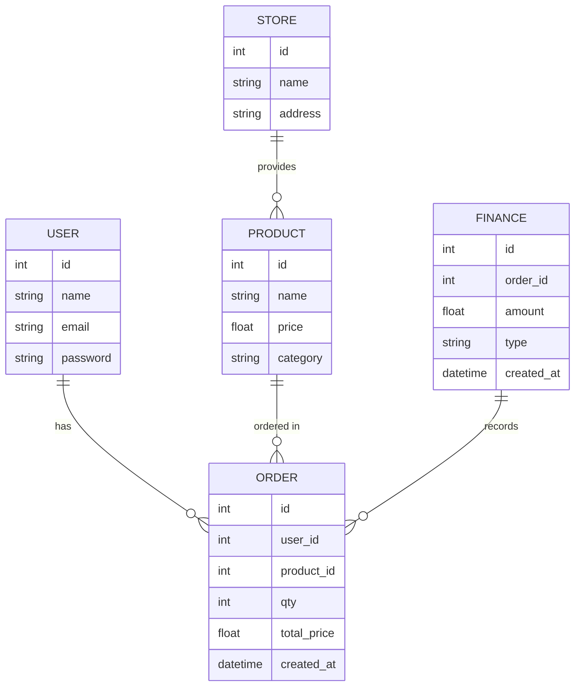
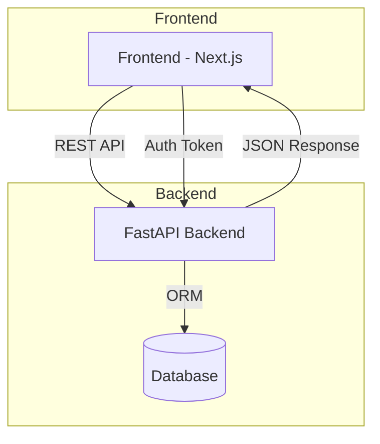
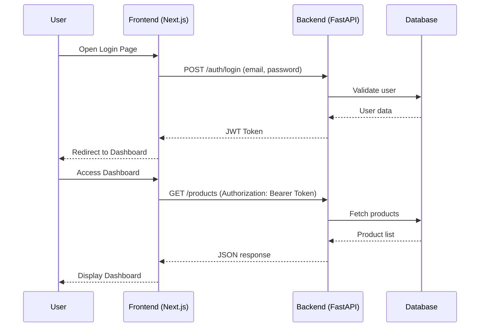

# Print Business Management System

A full‑stack application for managing printing business operations including products, orders, finance, stores, and user authentication. Built with **FastAPI** (Backend) and **Next.js** (Frontend).

---

## 🚀 Features

* User Authentication (JWT)
* Product Management
* Order Management
* Financial Records
* Store Data
* Admin Dashboard (Next.js)
* Modular backend architecture (routers, models, schemas, services)

---

# 📂 Project Structure

```
print-business-api/
│
├── backend/
│   └── app/
│       ├── main.py
│       ├── database.py
│       ├── models/
│       ├── routers/
│       ├── schemas/
│       ├── services/
│       └── seeders/
│
└── frontend/
    └── printing-dashboard/
        ├── src/
        ├── public/
        └── package.json
```

---

# ⚙️ Backend Setup (FastAPI)

## 1. Create virtual environment

```
python -m venv venv
source venv/bin/activate  # Mac/Linux
venv\\Scripts\\activate   # Windows
```

## 2. Install dependencies

```
pip install -r requirements.txt
```

## 3. Create `.env`

```
DATABASE_URL=sqlite:///./app.db
JWT_SECRET=your-secret-key
JWT_ALGORITHM=HS256
```

## 4. Run backend

```
uvicorn app.main:app --reload --port 8000
```

API Docs: [http://localhost:8000/docs](http://localhost:8000/docs)

---

# 🎨 Frontend Setup (Next.js)

## 1. Install dependencies

```
cd frontend/printing-dashboard
npm install
```

## 2. Configure API URL

Create `.env.local`:

```
NEXT_PUBLIC_API_URL=http://localhost:8000
```

## 3. Run Dev Server

```
npm run dev
```

Dashboard: [http://localhost:8000](http://localhost:8000)

---

# 🧱 Database ERD

Using **Mermaid ERD** (works in GitHub README):



---

# 🏗️ System Architecture Diagram



---

# 🔄 Sequence Diagram (User Login → View Dashboard)



---

# 📜 License

MIT — free to use and modify.

---

# 📞 Support

Jika ingin menambah fitur, optimasi, atau dokumentasi tambahan, hubungi developer atau open issue di repository.
